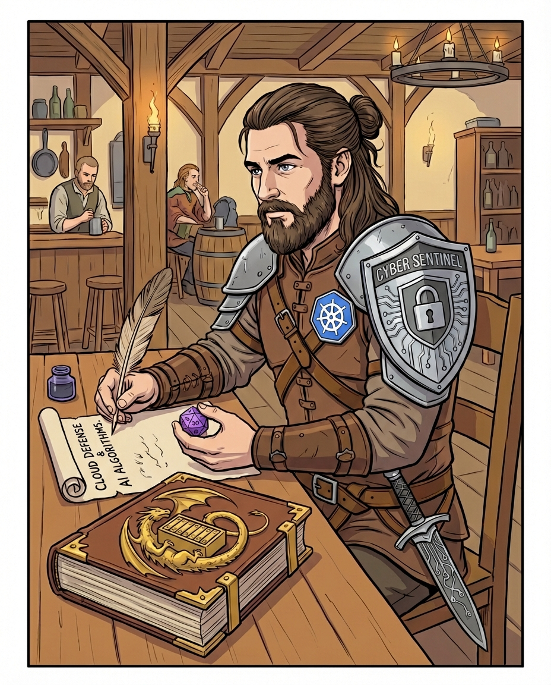
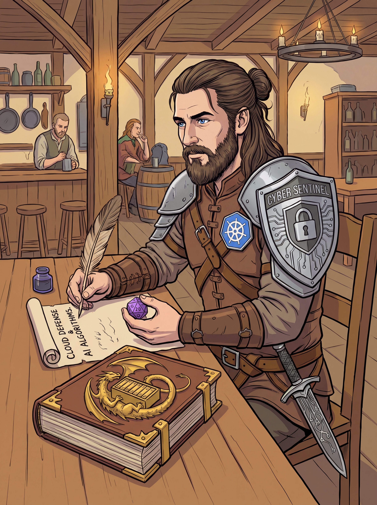

# CV

  

    <picture class="cv-hero__picture">
      <source media="(max-width: 840px)" srcset="assets/profilepic-mobile.jpg" />
      
    </picture>
    

      
    

  

  

    <h2 class="cv-hero__name">Mattia Pini</h2>
    
Senior Defense Security Engineer

    
Senior Defense Security Engineer with 8+ years in cybersecurity. At Satispay I built the defensive security capability from the ground up: SIEM and detection engineering, cloud security on AWS and GCP, and security automation with AI agents. Previously focused on data protection and Microsoft cloud security in banking and consulting. Speaker at AWS Summit Milan and RomHack Camp in 2026.

    
"Leave this world a little better than you found it"

    

      <a class="cv-chip cv-chip--icononly cv-chip--email" href="mailto:cv@d-o-c.cloud" title="Email" aria-label="Email"><svg aria-hidden="true" focusable="false" xmlns="http://www.w3.org/2000/svg" viewBox="0 0 24 24"><path d="m20 8-8 5-8-5V6l8 5 8-5m0-2H4c-1.11 0-2 .89-2 2v12a2 2 0 0 0 2 2h16a2 2 0 0 0 2-2V6a2 2 0 0 0-2-2"/></svg>Email</a>
      <a class="cv-chip cv-chip--icononly cv-chip--linkedin" href="https://www.linkedin.com/in/MattiaPini" target="_blank" rel="noopener" title="LinkedIn" aria-label="LinkedIn"><i class="fa-brands fa-linkedin-in" aria-hidden="true"></i>LinkedIn</a>
      <a class="cv-chip cv-chip--icononly cv-chip--github" href="https://github.com/D-o-c" target="_blank" rel="noopener" title="GitHub · D-o-c" aria-label="GitHub · D-o-c"><i class="fa-brands fa-github" aria-hidden="true"></i>GitHub · D-o-c</a>
      <a class="cv-chip cv-chip--icononly cv-chip--github" href="https://github.com/D-o-c-labs" target="_blank" rel="noopener" title="GitHub · D-o-c-labs" aria-label="GitHub · D-o-c-labs"><i class="fa-brands fa-square-github" aria-hidden="true"></i>GitHub · D-o-c-labs</a>
      <a class="cv-chip cv-chip--icononly cv-chip--k8s" href="https://github.com/D-o-c-labs/Doc-Home-ops" target="_blank" rel="noopener" title="Doc-Home-ops" aria-label="Doc-Home-ops"><svg aria-hidden="true" focusable="false" xmlns="http://www.w3.org/2000/svg" viewBox="0 0 24 24"><path d="m10.204 14.35.007.01-.999 2.413a5.17 5.17 0 0 1-2.075-2.597l2.578-.437.004.005a.44.44 0 0 1 .484.606zm-.833-2.129a.44.44 0 0 0 .173-.756l.002-.011L7.585 9.7a5.14 5.14 0 0 0-.73 3.255l2.514-.725zm1.145-1.98a.44.44 0 0 0 .699-.337l.01-.005.15-2.62a5.14 5.14 0 0 0-3.01 1.442l2.147 1.523zm.76 2.75.723.349.722-.347.18-.78-.5-.623h-.804l-.5.623.179.779zm1.5-3.095a.44.44 0 0 0 .7.336l.008.003 2.134-1.513a5.2 5.2 0 0 0-2.992-1.442l.148 2.615zm10.876 5.97-5.773 7.181a1.6 1.6 0 0 1-1.248.594l-9.261.003a1.6 1.6 0 0 1-1.247-.596l-5.776-7.18a1.58 1.58 0 0 1-.307-1.34L2.1 5.573c.108-.47.425-.864.863-1.073L11.305.513a1.6 1.6 0 0 1 1.385 0l8.345 3.985c.438.209.755.604.863 1.073l2.062 8.955c.108.47-.005.963-.308 1.34m-3.289-2.057c-.042-.01-.103-.026-.145-.034-.174-.033-.315-.025-.479-.038-.35-.037-.638-.067-.895-.148-.105-.04-.18-.165-.216-.216l-.201-.059a6.5 6.5 0 0 0-.105-2.332 6.5 6.5 0 0 0-.936-2.163c.052-.047.15-.133.177-.159.008-.09.001-.183.094-.282.197-.185.444-.338.743-.522.142-.084.273-.137.415-.242.032-.024.076-.062.11-.089.24-.191.295-.52.123-.736s-.506-.236-.745-.045c-.034.027-.08.062-.111.088-.134.116-.217.23-.33.35-.246.25-.45.458-.673.609-.097.056-.239.037-.303.033l-.19.135a6.55 6.55 0 0 0-4.146-2.003l-.012-.223c-.065-.062-.143-.115-.163-.25-.022-.268.015-.557.057-.905.023-.163.061-.298.068-.475.001-.04-.001-.099-.001-.142 0-.306-.224-.555-.5-.555-.275 0-.499.249-.499.555l.001.014c0 .041-.002.092 0 .128.006.177.044.312.067.475.042.348.078.637.056.906a.55.55 0 0 1-.162.258l-.012.211a6.42 6.42 0 0 0-4.166 2.003l-.18-.128c-.09.012-.18.04-.297-.029-.223-.15-.427-.358-.673-.608-.113-.12-.195-.234-.329-.349l-.111-.088a.6.6 0 0 0-.348-.132.48.48 0 0 0-.398.176c-.172.216-.117.546.123.737l.007.005.104.083c.142.105.272.159.414.242.299.185.546.338.743.522.076.082.09.226.1.288l.16.143a6.46 6.46 0 0 0-1.02 4.506l-.208.06c-.055.072-.133.184-.215.217-.257.081-.546.11-.895.147-.164.014-.305.006-.48.039-.037.007-.09.02-.133.03l-.004.002-.007.002c-.295.071-.484.342-.423.608.061.267.349.429.645.365l.007-.001.01-.003.129-.029c.17-.046.294-.113.448-.172.33-.118.604-.217.87-.256.112-.009.23.069.288.101l.217-.037a6.5 6.5 0 0 0 2.88 3.596l-.09.218c.033.084.069.199.044.282-.097.252-.263.517-.452.813-.091.136-.185.242-.268.399-.02.037-.045.095-.064.134-.128.275-.034.591.213.71.248.12.556-.007.69-.282v-.002c.02-.039.046-.09.062-.127.07-.162.094-.301.144-.458.132-.332.205-.68.387-.897.05-.06.13-.082.215-.105l.113-.205a6.45 6.45 0 0 0 4.609.012l.106.192c.086.028.18.042.256.155.136.232.229.507.342.84.05.156.074.295.145.457.016.037.043.09.062.129.133.276.442.402.69.282.247-.118.341-.435.213-.71-.02-.039-.045-.096-.065-.134-.083-.156-.177-.261-.268-.398-.19-.296-.346-.541-.443-.793-.04-.13.007-.21.038-.294-.018-.022-.059-.144-.083-.202a6.5 6.5 0 0 0 2.88-3.622c.064.01.176.03.213.038.075-.05.144-.114.28-.104.266.039.54.138.87.256.154.06.277.128.448.173.036.01.088.019.13.028l.009.003.007.001c.297.064.584-.098.645-.365.06-.266-.128-.537-.423-.608M16.4 9.701l-1.95 1.746v.005a.44.44 0 0 0 .173.757l.003.01 2.526.728a5.2 5.2 0 0 0-.108-1.674A5.2 5.2 0 0 0 16.4 9.7zm-4.013 5.325a.44.44 0 0 0-.404-.232.44.44 0 0 0-.372.233h-.002l-1.268 2.292a5.16 5.16 0 0 0 3.326.003l-1.27-2.296zm1.888-1.293a.44.44 0 0 0-.27.036.44.44 0 0 0-.214.572l-.003.004 1.01 2.438a5.15 5.15 0 0 0 2.081-2.615l-2.6-.44z"/></svg>Doc-Home-ops</a>
      <a class="cv-chip cv-chip--icononly cv-chip--download cv-chip--accent" href="assets/MattiaPini_CV.pdf" title="Download PDF" aria-label="Download PDF"><i class="fa-solid fa-file-pdf" aria-hidden="true"></i>Download PDF</a>
    

  

## Experience

  <article class="cv-card reveal">
    <header class="cv-card__header cv-card__header--with-logo">
      

        S
        <h3>Senior Defense Security Engineer</h3>
      

      
2026--Present

    </header>
    
Satispay · Milan · Defensive Security

    <ul>
      <li>Co-own the defensive security strategy with the CISO and run sprints for the four-engineer defensive team</li>
      <li>Interim line manager for two engineers; previously line-managed one engineer (2025--2026)</li>
      <li>Leading the migration of the security AI agents to Amazon Bedrock AgentCore</li>
      <li>Security architecture reviews (Keycloak CIAM, Spring Cloud Gateway), vendor risk assessments and audit support (CSSF)</li>
    </ul>
  </article>
  <article class="cv-card reveal">
    <header class="cv-card__header cv-card__header--with-logo">
      

        S
        <h3>Cloud Security Engineer</h3>
      

      
2023--2026

    </header>
    
Satispay · Milan · Security Team

    <ul>
      <li>First security engineer alongside the CISO: built the defensive security function from scratch, single-handedly for the first 18 months</li>
      <li>Led the SIEM selection and the Splunk rollout; defined log onboarding standards (CIM) for 20+ sources</li>
      <li>Designed risk-based alerting for customer account takeover</li>
      <li>Built AI agents that triage security alerts and, after analyst approval, handle remediation, stakeholder communication and incident reporting</li>
      <li>Moved AWS WAF to default-deny with self-service allowlisting through Terraform pull requests</li>
      <li>Led AWS and GCP security governance: SCP review, GCP hierarchy redesign, external configuration assessment and remediation</li>
      <li>Led the passkey rollout on Google Workspace</li>
    </ul>
  </article>
  <article class="cv-card reveal">
    <header class="cv-card__header cv-card__header--with-logo">
      

        
        <h3>Security Lead Consultant</h3>
      

      
2022--2023

    </header>
    
Horizon Consulting · Milan

    <ul>
      <li>Azure/M365/Infrastructure cloud security assessments for an international energy company</li>
      <li>Defined architecture for Microsoft Data Loss Prevention on macOS devices in a nationwide energy enterprise</li>
      <li>Developed a PowerShell module to automate Azure Multi-Factor Authentication management</li>
      <li>Implemented process workflows with Microsoft Power Automate for a global optical company</li>
      <li>Performed microservices security analysis (JWT vs mTLS)</li>
    </ul>
  </article>
  <article class="cv-card reveal">
    <header class="cv-card__header cv-card__header--with-logo">
      

        
        <h3>Security Project Manager</h3>
      

      
2020--2022

    </header>
    
UniCredit Services · Milan · Data Security Specialist

    <ul>
      <li>Managed enterprise Azure/O365 security projects (Hybrid AD, MIP, DLP, Sentinel)</li>
      <li>Defined security KPIs and toxic combination controls</li>
      <li>Supported internal and external security audits</li>
      <li>Developed data security governance policies and standards</li>
    </ul>
  </article>
  <article class="cv-card reveal">
    <header class="cv-card__header cv-card__header--with-logo">
      

        
        <h3>Security and Technical Application Manager</h3>
      

      
2018--2020

    </header>
    
UniCredit Services · Milan · Data Security Specialist

    <ul>
      <li>Defined data security requirements for new applications</li>
      <li>Designed application architectures with data security best practices</li>
      <li>Implemented enterprise data security policies and operating models</li>
      <li>Authored technical documentation for secure data flows</li>
    </ul>
  </article>

## Talks and Workshops

  <article class="cv-card reveal">
    <header class="cv-card__header">
      <h3><a href="https://romhack.io/romhack-schedule/" target="_blank" rel="noopener">Keep caLLM and Let It Block: Agentic SOAR with n8n + Splunk</a></h3>
      
2026

    </header>
    
Workshop · RomHack Camp · Rome

    
Hands-on workshop delivered with three Satispay colleagues. I designed and built the entire lab: a live AWS environment (WAF, Splunk, n8n, Amazon Bedrock; Terraform, Ansible) where participants built an AI-assisted incident-response pipeline with human approval.

  </article>
  <article class="cv-card reveal">
    <header class="cv-card__header">
      <h3><a href="https://aws.amazon.com/it/events/summits/milano/agenda/?ams%23interactive-card-vertical%23pattern-data--1491781557.search=mobile" target="_blank" rel="noopener">Satispay: proteggere le API con AWS WAF Mobile SDK</a></h3>
      
2026

    </header>
    
Talk (IND335, Advanced) · AWS Summit Milan · Milan

    
How integrating AWS WAF with the Satispay mobile app through the Mobile SDK virtually eliminated anomalous traffic to our APIs. Co-presented with the CISO (opening and closing); I delivered the technical content.

  </article>

## Awards

- **2026** — 1st in Italy, 3rd in EMEA, Splunk Boss of the SOC (BOTS) — With the Satispay Security Team, among 358 teams

## Certifications

- **2022** — Certified Kubernetes Administrator (CKA) (Linux Foundation)

## Education

  <article class="cv-card reveal">
    <h3>1st Level University Master Degree</h3>
    
2018--2020

    
CEFriel (Politecnico di Milano)

    
Information Security Specialist

  </article>
  <article class="cv-card reveal">
    <h3>Master Degree</h3>
    
2014--2018

    
Politecnico di Milano

    
Computer Science and Engineering

  </article>
  <article class="cv-card reveal">
    <h3>Bachelor&#x27;s Degree</h3>
    
2010--2014

    
Politecnico di Milano

    
Computer Science and Engineering

  </article>

## Skills

  <article class="cv-card reveal">
    <h3>Technical</h3>
    

      <article class="cv-meter-item cv-meter-item--has-details" role="button" tabindex="0">
        

          

            Architecture
            4/5
          

          

        

        

          
Architecture

          
Security design reviews, security requirements, threat modeling, API gateway and service authentication (JWT vs mTLS), vendor risk, audit support in a regulated fintech

          
Tap or press Enter to return

        

      </article>
      <article class="cv-meter-item cv-meter-item--has-details" role="button" tabindex="0">
        

          

            Automation and AI
            5/5
          

          

        

        

          
Automation and AI

          
n8n, Make.com, LLM agents for alert triage and incident handling (Claude, Gemini), Amazon Bedrock AgentCore, Slack and GitHub integrations, Python

          
Tap or press Enter to return

        

      </article>
      <article class="cv-meter-item cv-meter-item--has-details" role="button" tabindex="0">
        

          

            Cloud Security
            5/5
          

          

        

        

          
Cloud Security

          
AWS (Organizations, SCP, CloudTrail, GuardDuty, Security Hub, WAF), GCP (resource hierarchy, configuration hardening), Azure, Terraform

          
Tap or press Enter to return

        

      </article>
      <article class="cv-meter-item cv-meter-item--has-details" role="button" tabindex="0">
        

          

            Data Protection
            5/5
          

          

        

        

          
Data Protection

          
Data classification, Microsoft Purview/MIP, DLP controls, anonymization, security policy and standard definition

          
Tap or press Enter to return

        

      </article>
      <article class="cv-meter-item cv-meter-item--has-details" role="button" tabindex="0">
        

          

            Detection and SIEM
            5/5
          

          

        

        

          
Detection and SIEM

          
Splunk (SPL, CIM, risk-based alerting), log onboarding and parsing pipelines, OpenSearch

          
Tap or press Enter to return

        

      </article>
      <article class="cv-meter-item cv-meter-item--has-details" role="button" tabindex="0">
        

          

            Identity
            4/5
          

          

        

        

          
Identity

          
Keycloak/CIAM, OAuth2/OIDC, passkeys, Google Workspace, Entra ID/MFA, Conditional Access, joiner/mover/leaver automation

          
Tap or press Enter to return

        

      </article>
      <article class="cv-meter-item cv-meter-item--has-details" role="button" tabindex="0">
        

          

            Incident Response
            4/5
          

          

        

        

          
Incident Response

          
End-to-end incident handling, automated response playbooks, stakeholder communication, incident reporting

          
Tap or press Enter to return

        

      </article>
      <article class="cv-meter-item cv-meter-item--has-details" role="button" tabindex="0">
        

          

            Kubernetes
            4/5
          

          

        

        

          
Kubernetes

          
Kubernetes (CKA), Talos, FluxCD GitOps, Cilium network policies, External Secrets and SOPS, Docker, Rancher

          
Tap or press Enter to return

        

      </article>
    

  </article>
  <article class="cv-card reveal">
    <h3>Soft Skills</h3>
    

      <article class="cv-meter-item cv-meter-item--has-details" role="button" tabindex="0">
        

          

            Adaptability
            4/5
          

          

        

        

          
Adaptability

          
Fast context switching across projects, tools, and organizational priorities.

          
Tap or press Enter to return

        

      </article>
      <article class="cv-meter-item cv-meter-item--has-details" role="button" tabindex="0">
        

          

            Communication
            5/5
          

          

        

        

          
Communication

          
Clear communication across technical and non-technical stakeholders.

          
Tap or press Enter to return

        

      </article>
      <article class="cv-meter-item cv-meter-item--has-details" role="button" tabindex="0">
        

          

            Critical Thinking
            5/5
          

          

        

        

          
Critical Thinking

          
Structured analysis of risks, assumptions, and tradeoffs before execution.

          
Tap or press Enter to return

        

      </article>
      <article class="cv-meter-item cv-meter-item--has-details" role="button" tabindex="0">
        

          

            Problem-Solving
            5/5
          

          

        

        

          
Problem-Solving

          
Pragmatic problem decomposition and delivery-focused resolution under constraints.

          
Tap or press Enter to return

        

      </article>
      <article class="cv-meter-item cv-meter-item--has-details" role="button" tabindex="0">
        

          

            Stakeholder Management
            4/5
          

          

        

        

          
Stakeholder Management

          
Cross-functional alignment with engineering, operations, risk, and governance teams.

          
Tap or press Enter to return

        

      </article>
    

  </article>

## Languages

  <article class="cv-card reveal cv-language-item">
    

      

        <strong>English</strong>
        C1 Level
      

      

        
        
        
        
        
      

    

  </article>
  <article class="cv-card reveal cv-language-item">
    

      

        <strong>Italian</strong>
        Native Language
      

      

        
        
        
        
        
      

    

  </article>

## Hobbies and Interests

  <ul>
    <li>In my spare time, I run a self-hosted Kubernetes homelab (Talos, FluxCD GitOps, Cilium) for home-network services and home automation.</li>
    <li>Moreover, I play the Cajon in a band, performing live around Milan.</li>
    <li>I also like role-playing games like Pathfinder and D&amp;D.</li>
    <li>Until some years ago, I was a scout group leader in an AGESCI scout group.</li>
  </ul>

